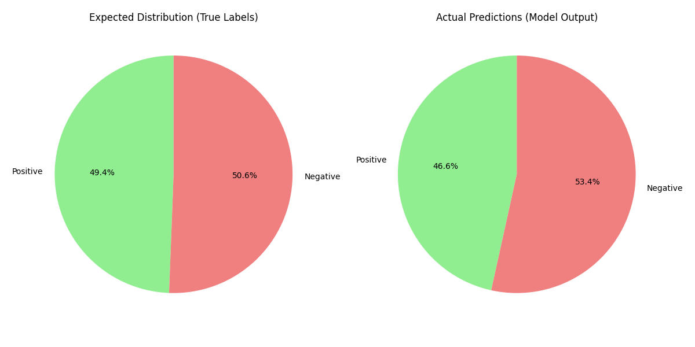
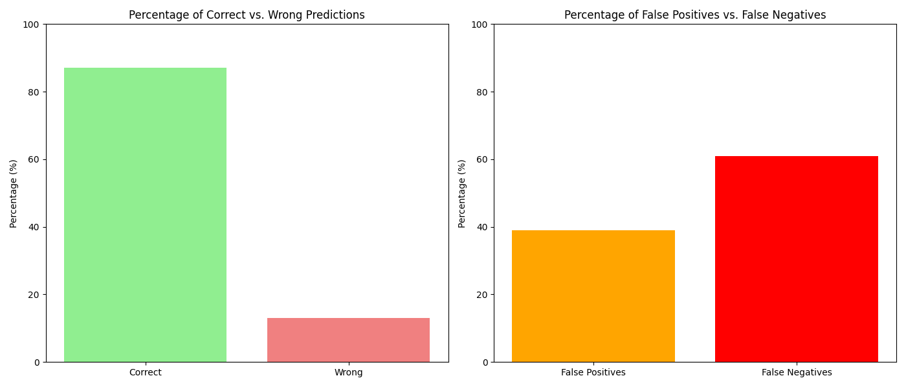

# Film-Reviews-Classification-Sequential-Neural-Network

## Overview

This project builds a deep learning model to classify IMDB movie reviews as positive or negative. It uses a neural network with an embedding layer and trains the model on a labeled dataset. The project also includes visualizations to analyze the model’s predictions.

## Features

- Data loading and preprocessing from CSV files
- Text tokenization and padding to standardize input length
- Deep learning model using TensorFlow and Keras
- Evaluation and visualization of sentiment classification
- Pie chart of actual vs predicted sentiments
- Bar graph showing classification accuracy and error types

## Installation

### Prerequisites

Ensure you have the following installed:

- Python 3.x
- TensorFlow
- NumPy
- Pandas
- Matplotlib

### Install Required Libraries

You can install the necessary libraries using:

```sh
pip install tensorflow pandas numpy matplotlib
```

## Dataset

The project uses two CSV files:

- **Training set:** `IMDB Dataset.csv`
- **Testing set:** `testing data.csv`

Each file includes:
- `review`: The text of the movie review
- `sentiment`: The label ("positive" or "negative")


### Workflow

1. Load review texts and sentiment labels from CSV.
2. Convert text labels to binary form (`1` for positive, `0` for negative).
3. Tokenize and pad sequences to a fixed length (600).
4. Train a neural network model using an embedding layer and dense layers.
5. Evaluate accuracy on test data.
6. Predict sentiment and visualize results using pie and bar charts.

## Output & Visualization

The project generates the following:

- **Model Accuracy (87%)** printed in the terminal.
- **Pie Charts**: 
  - Actual sentiment distribution (true labels)
  - Predicted sentiment distribution (model output)

- **Bar Charts**:
  - Percentage of correct vs wrong predictions
  - Breakdown of false positives vs false negatives

### Visual Output

#### Pie Charts

Actual vs Predicted Sentiment Distribution:



#### Bar Charts

Correct vs. Wrong Predictions & Error Breakdown:




## Contact

For inquiries, contact Mahmoud Hossam at [mahmoudhossam@aucegypt.edu](mailto:mahmoudhossam@aucegypt.edu)
